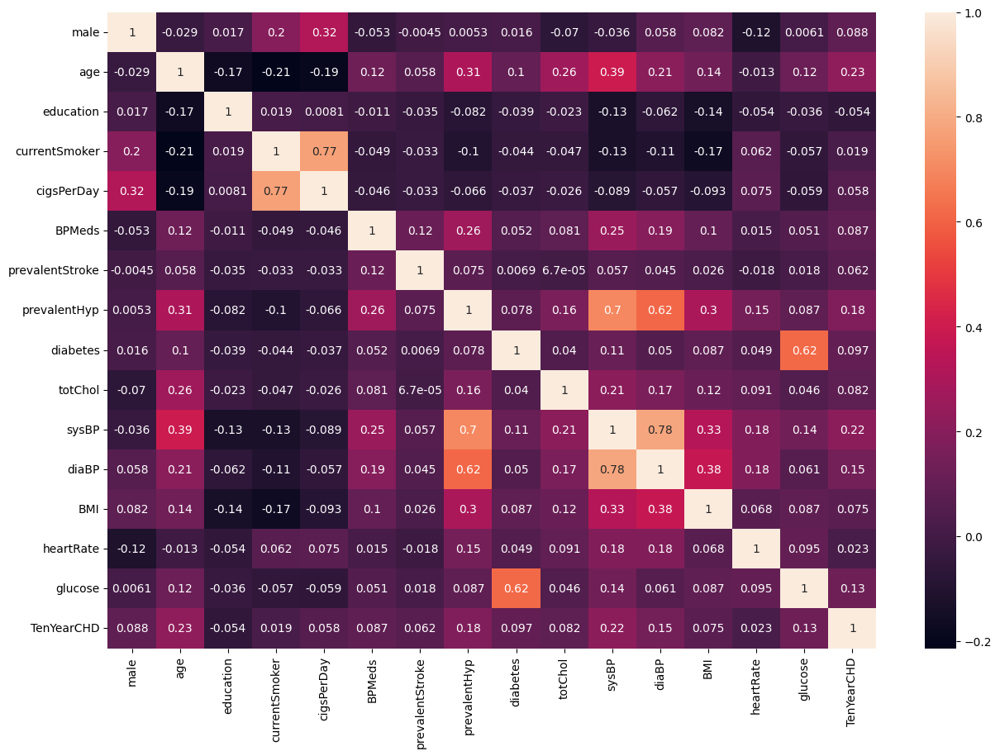

# 📊 Logistic Regression Case Study – AIDI 1002 Assignment 1

**About this Project**

This logistic regression case study was completed as part of the AIDI 1002 course at Durham College. It provided a hands-on opportunity to apply core data science techniques including data cleaning, feature engineering, model training, hyperparameter tuning, and performance evaluation using real-world medical data. The project highlights my ability to translate theoretical concepts into practical machine learning solutions, making it a valuable example of my growing expertise in predictive analytics.

---

This repository showcases the application of a **Logistic Regression** model on a real-world dataset, as part of the AIDI 1002 course assignment. The project demonstrates proficiency in data preprocessing, feature engineering, model training, and evaluation, along with visualizing results and explaining insights.

> ✅ **Status:** Completed  
> 🎓 **Course:** AIDI 1002 – Data Science and Machine Learning  
> 🧠 **Focus:** Logistic Regression Model

---

## 📁 Project Structure

- `notebooks/`: Jupyter notebooks for exploration and modeling.
- `images/`: Contains visualization images referenced in this README.
- `README.md`: Project overview and methodology.

---

## 🎯 Objectives

- Apply **Logistic Regression** to predict the 10-year risk of Coronary Heart Disease (CHD) using the Framingham Heart Study dataset.
- Perform data cleaning and feature engineering, including handling missing data and visualizing feature correlations.
- Train, tune, and evaluate the logistic regression model using accuracy, confusion matrix, and hyperparameter optimization.

---

## 📂 Dataset: Framingham Heart Study

- **Source:** Kaggle – [Framingham Heart Study Dataset](https://www.kaggle.com/dileep070/heart-disease-prediction-using-logistic-regression)
- **Description:** Medical records including demographics, habits, and health metrics to predict coronary heart disease risk within 10 years.
- **Target Variable:** `TenYearCHD` (1 = developed CHD in 10 years, 0 = did not)
- **Features (selected):**  
  `male, age, education, currentSmoker, cigsPerDay, BPMeds, prevalentStroke, prevalentHyp, diabetes, totChol, sysBP, diaBP, BMI, heartRate, glucose`
- **Data Shape:**  
  Initial: 4238 rows × 16 columns  
  After cleaning: 3656 rows × 16 columns (no missing values)

---

## ⚙️ Feature Engineering & Data Cleaning

- Identified missing values in several columns (`education`, `cigsPerDay`, `BPMeds`, `totChol`, `BMI`, `heartRate`, `glucose`).
- Dropped all rows with missing data, resulting in 3656 complete samples.
- Confirmed no duplicate records.
- Created a correlation matrix heatmap to explore feature relationships.

  
*Figure 1: Correlation matrix heatmap showing relationships among features and target.*

---

## 🤖 Model Development: Logistic Regression

- Split data into training (80%) and validation (20%) sets.
- Trained logistic regression with `max_iter=2000`.
- Initial validation accuracy: **~85.8%**.
- Confusion matrix on validation data:

  
*Figure 2: Confusion matrix for initial logistic regression model.*

- Performed hyperparameter tuning using GridSearchCV over:
  - `C`: [0.001, 0.01, 0.1, 1, 10, 100, 1000]
  - `max_iter`: [100, 1000, 2500, 5000]
  - `solver`: ['lbfgs', 'liblinear', 'sag', 'saga']
- Best parameters found:  
  `{'C': 1, 'max_iter': 2500, 'solver': 'lbfgs'}`
- Best cross-validation accuracy: **~85.3%**
- Confusion matrix with best estimator:

  
*Figure 3: Confusion matrix after hyperparameter tuning.*

---

## 📊 Evaluation & Insights

- Strong overall accuracy, but recall for positive CHD cases is low (8 true positives vs 97 false negatives).
- Features like `age`, `sysBP`, and `glucose` show positive correlation with CHD risk.
- Imbalance in classes suggests potential improvements via class weighting or oversampling methods.

---

## 🛠️ Tech Stack

- Python 3.x
- Pandas, NumPy, Matplotlib, Seaborn
- Scikit-learn (LogisticRegression, GridSearchCV)
- Jupyter Notebook / Google Colab

---

## 📌 Future Work

- Implement techniques for handling class imbalance (e.g., SMOTE, class weighting).
- Feature scaling and polynomial feature engineering.
- Additional performance metrics (ROC-AUC) and detailed feature importance plots.

---

## 📬 Contact

**Agilan Sivakumaran**  
[LinkedIn](#) • [Portfolio](#) • [Email](mailto:your.email@example.com)

---
